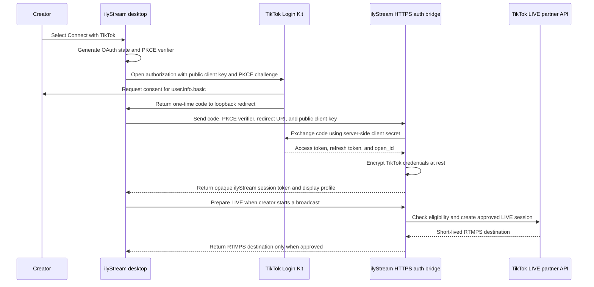

# TikTok review package for ilyStream

This package keeps two approvals separate:

1. **Login Kit review** covers TikTok account authorization and `user.info.basic`.
2. **TikTok LIVE partner access** covers eligibility, LIVE room creation, short-lived RTMPS ingest,
   session status, and clean session completion.

Login Kit does not grant direct TikTok LIVE ingestion. ilyStream must keep native LIVE publishing
disabled until TikTok supplies and approves the private LIVE partner contract.

The partner request text and the bridge contract are in
[`tiktok-live-partner-application.md`](./tiktok-live-partner-application.md).

## Submission checklist

### App and public properties

- [x] TikTok developer organization created
- [x] ilyStream registered as a Desktop app
- [x] App icon uploaded
- [x] Product website published
- [x] Privacy Policy published
- [x] Terms of Service published
- [x] Support email supplied to TikTok
- [x] Login Kit enabled
- [x] `user.info.basic` requested
- [x] Desktop redirect URI registered as `http://127.0.0.1:8792/callback/`
- [x] Production app submitted for review
- [x] Sandbox created from the submitted configuration
- [x] Reviewer/test account added as a sandbox target user
- [ ] Confirm the target user has been active for at least one hour before recording the demo

### Reviewer delivery

- [ ] Produce a signed Windows reviewer build
- [ ] Record the installer/build version and SHA-256 checksum
- [ ] Supply a sandbox target-user account through TikTok's approved private reviewer channel
- [ ] Include the reviewer steps below with the build
- [ ] Record the two-to-five minute Login Kit demo using the script below
- [ ] Attach the architecture diagram from this document
- [ ] Attach the partner access request from `tiktok-live-partner-application.md`
- [ ] Name a launch owner and security contact
- [ ] State expected beta date, creator count, and projected monthly LIVE sessions

Do not place passwords, one-time codes, client secrets, refresh tokens, or reviewer credentials in
this repository, the demo video, issue trackers, or ordinary email.

## Reviewer build notes

Fill these values immediately before submission:

| Field | Value |
| --- | --- |
| Build version | `TBD` |
| Installer filename | `TBD` |
| SHA-256 | `TBD` |
| Supported OS | Windows 10/11 x64 |
| TikTok sandbox | `ilyStream Login Kit Test` |
| Redirect URI | `http://127.0.0.1:8792/callback/` |
| Requested scope | `user.info.basic` |
| Support contact | `drwdoesstuff@gmail.com` |

## Reviewer instructions

1. Confirm the supplied TikTok account is listed under **Sandbox settings → Target users**.
2. If the account was just added, allow up to one hour for TikTok to activate it.
3. Install and open the supplied ilyStream reviewer build.
4. Open **Connect → TikTok**.
5. Under **Official TikTok LIVE Access**, select **Connect with TikTok**.
6. In the browser, sign in with the supplied target-user account if needed.
7. Approve ilyStream's request for basic profile access.
8. Confirm the browser reports that TikTok connected and can be closed.
9. Return to ilyStream and confirm the account display name and connection state are visible.
10. Select **Disconnect official account** and confirm the UI returns to the ready state.

Expected result: TikTok authorization completes through the loopback redirect, ilyStream exchanges
the one-time grant through its HTTPS bridge, and the desktop receives only an opaque ilyStream
session token. Direct LIVE publishing remains marked as pending until partner access is approved.

## Two-to-five minute demo script

Target runtime: **3 minutes 15 seconds**.

### 0:00–0:20 — Identify the product

- Show the ilyStream title bar and version.
- Say: “ilyStream is a Windows broadcast studio for scenes, cameras, audio, overlays, recording,
  chat, and multi-platform streaming.”
- Open **Connect → TikTok**.

### 0:20–0:45 — Show the security boundary

- Show the registered desktop redirect URI in ilyStream.
- Point out that only the public client key is present in the desktop app.
- Say: “The client secret, TikTok access token, and refresh token stay on ilyStream's HTTPS auth
  bridge. The desktop receives only an opaque ilyStream session token.”

### 0:45–1:35 — Complete Login Kit authorization

- Select **Connect with TikTok**.
- Show the four stages: **Open browser**, **Approve access**, **Secure exchange**, **Connected**.
- In the browser, identify the sandbox target-user account and approve access.
- Show the local success page, then return to ilyStream.

### 1:35–2:05 — Verify the result

- Show the connected TikTok display name.
- Show the review/entitlement state.
- Explain that `user.info.basic` is used only for the authorized creator's display name, avatar,
  and connection identity.

### 2:05–2:35 — Demonstrate disconnect

- Select **Disconnect official account**.
- Show that ilyStream returns to the ready state.
- Say: “Disconnect revokes or deletes the server-side TikTok credentials and invalidates the opaque
  desktop session.”

### 2:35–3:15 — Explain the requested LIVE capability

- Show the **Request LIVE access** action and the manual RTMP fallback fields.
- Say: “Native no-stream-key publishing remains disabled until TikTok grants partner access. After
  approval, the bridge will check creator eligibility, create the LIVE room, obtain short-lived
  RTMPS ingest, monitor the session, and finalize it. ilyStream does not scrape TikTok or extract
  credentials from cookies.”

## Architecture and token handling



Security properties:

- OAuth state is unique per attempt and verified before accepting the callback.
- Desktop Login Kit uses PKCE with `S256`.
- The loopback listener accepts only the registered callback route and closes after completion,
  cancellation, restart, or timeout.
- A new authorization attempt cancels the previous attempt.
- The client secret and TikTok refresh token never enter the Electron renderer or saved platform
  configuration.
- TikTok credentials are encrypted server-side; the desktop stores only an opaque ilyStream token.
- Native LIVE ingest is returned only after the bridge confirms current authorization and approved
  partner entitlement.
- LIVE completion is idempotent and must reconcile sessions orphaned by a desktop crash or network
  loss.

## Pre-recording verification

Run these checks from the repository root before creating the reviewer build:

```text
npm run lint
npm test -- src/main/platforms/tiktok/tiktok-native-auth.test.ts
npm test -- services/tiktok-auth-bridge/src
npm run build
```

Then verify manually:

- [ ] The public client key matches the selected TikTok app/sandbox.
- [ ] The redirect URI matches exactly, including port and trailing slash.
- [ ] The auth bridge health endpoint is reachable over HTTPS.
- [ ] The browser opens only after the loopback listener is ready.
- [ ] Cancel stops the countdown and releases the callback route.
- [ ] Retry replaces an older attempt instead of starting a second listener.
- [ ] Denial and timeout messages are understandable and do not expose raw IPC errors.
- [ ] Successful authorization reaches **Connected**.
- [ ] Disconnect removes the desktop session and returns to **Ready**.
- [ ] Logs contain no client secret, TikTok token, refresh token, authorization code, or reviewer
  credential.

## Partner submission attachments

Submit these together so TikTok can review the product and the private LIVE request as one coherent
system:

1. Windows reviewer build and checksum
2. Public website, Privacy Policy, Terms of Service, and support contact
3. Login Kit demo video
4. This reviewer guide and architecture diagram
5. Partner access request from `tiktok-live-partner-application.md`
6. Abuse reporting and moderation behavior
7. Account disconnect and credential deletion behavior
8. Expected launch date, target creator profile, and estimated usage

If TikTok approves only Login Kit, ship account connection but keep native LIVE preparation disabled.
Manual TikTok-provided RTMP remains the fallback until the private LIVE contract is approved and
implemented against TikTok's supplied documentation.
